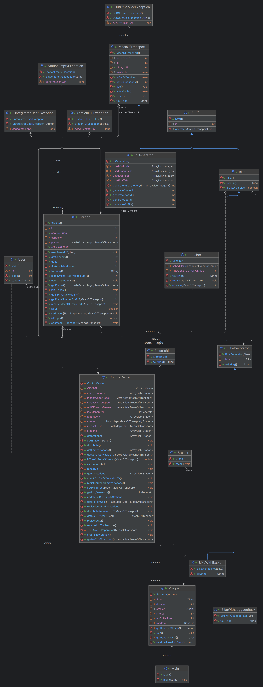

# Coo_Project_2023

## Team Members

- Omar Kode Ousmane
- Hamza Bikine

## Project overview
Welcome to our bike-sharing project! In this simulation, we aim to replicate the intricate dynamics of managing a shared bike service, inspired by prominent platforms like Vélib and V'Lille.

## Uml Diagram Modelization 



## How to

#### Get Project  sources :

Open your bash terminal and execute the following command.  _(make sure to specify your gitlab username and the directory in which you want to clone the project sources)_

```bash
~$ git clone https://gitlab-etu.fil.univ-lille.fr/[your-gitlab- username]kode_ousmane_omar_bikine_hamza_projet_coo.git cd [your-project-repo]
```

#### Generate Documentation

To generate documentation, run the following command in your bash terminal:

```bash
~/[Project_Repo]$ javadoc -sourcepath src -subpackages projet.vlille -d docs
```

#### Compile and Run Sources

To compile the sources, open your bash terminal and execute the following command from the project's main directory:

```bash
~/[Project_Repo]$ javac -cp classes/ -d classes src/projet/vlille/exception/*.java src/projet/vlille/idGenerator/IdGenerator.java src/projet/vlille/decorators/*.java src/projet/vlille/user/User.java src/projet/vlille/steal/Stealer.java src/projet/vlille/staff/Staff.java src/projet/vlille/staff/staffs/Repairer.java src/projet/vlille/meansOfTransport/MeanOfTransport.java src/projet/vlille/meansOfTransport/bike/Bike.java src/projet/vlille/meansOfTransport/bike/bikes/ElectricBike.java src/projet/vlille/controlCenter/ControlCenter.java src/projet/vlille/program/Program.java src/projet/vlille/station/Station.java src/projet/vlille/Main.java
```

To run the Main class execute the following command:

```bash
~/[Project_Repo]$ java -cp classes/ projet.vlille.Main
```
_Once the Main is launched, the simulation takes a bit more than 20 seconds to get to its end!_

#### Compile and Run Tests

To compile test sources, execute this command:

```bash
~/[Project_Repo]$ javac -cp junit-platform-console-standalone-1.7.2.jar:classes/ -d testClasses/ test/projet/vlille/staff/staffs/RepairerTest.java test/projet/vlille/meansOfTransport/bike/BikeTest.java test/projet/vlille/controlCenter/ControlCenterTest.java test/projet/vlille/idGenerator/IdGeneratorTest.java test/projet/vlille/station/StationTest.java 
```
To run tests, execute the following command:

```bash
~/[Project_Repo]$ java -jar junit-platform-console-standalone-1.7.2.jar  --class-path testClasses/:classes/ --scan-class-path
```

#### Generate Project Archive(.jar)

To generate the project archive(.jar), run the following command:

```bash
~/[Project_Repo]$ jar -cfe Main.jar projet.vlille.Main -C classes .
```

To execute the project archive, run this command:

```bash
~/[Project_Repo]$ java -jar Main.jar 
```

## Design elements and project development keys 

During the project's development, we've done some design choices to achieve modularity, flexibility and maintainability in our project, here's some of them:

1. **Singleton Design Pattern for ControlCenter:**
    - The decision to implement the `ControlCenter` class as a singleton is necessary. This ensures that there is only one central control instance overseeing the entire system, preventing multiple instances that might lead to inconsistencies or conflicting operations.

2. **Decorator Pattern for Bikes:**
    - Utilizing the decorator pattern for bikes through the `BikeDecorator` class is very useful in our conception. This allows for the dynamic attachment of additional features to bike objects, enhancing their functionality without modifying their underlying classes. It promotes flexibility and extensibility, enabling the easy addition of new features or modifications.

3. **Visitor Pattern for ID Generation:**
    - The use of the `IdGenerator` class with the id generator as a visitor in other classes ensures the generation of unique identifiers for each instance. This is an application of the visitor pattern, allowing the `IdGenerator` to visit different elements and generate unique IDs based on the specific requirements of each element.

4. **Template Method in IdGenerator:**
    - The template method, `generateIdByCategory`, used in the `IdGenerator` class is an interesting choice. It abstracts the common steps of the id generation process, allowing submethods to implement specific details. This promotes code reusability and maintains a consistent structure for generating different categories of IDs.

5. **Observer Pattern for Repairer Object:**
    - Implementing the repairer object as an observer is very practical. The repairer intervenes when a means of transport is out of service, serving as an observer to repair and make it available again. This adheres to the observer pattern, providing a clean and modular way to handle events and reactions in response to changes in the system.

6. **Timer class to simulate the time notion:**
    - The use of the `Timer` class to implement the notion of time specifically in the `operate` method of the `Repairer` class is practical as it allows to simulate a time duration for the repair process and ensure that the means of transport under repair are rendered unusable during the repair process duration.


